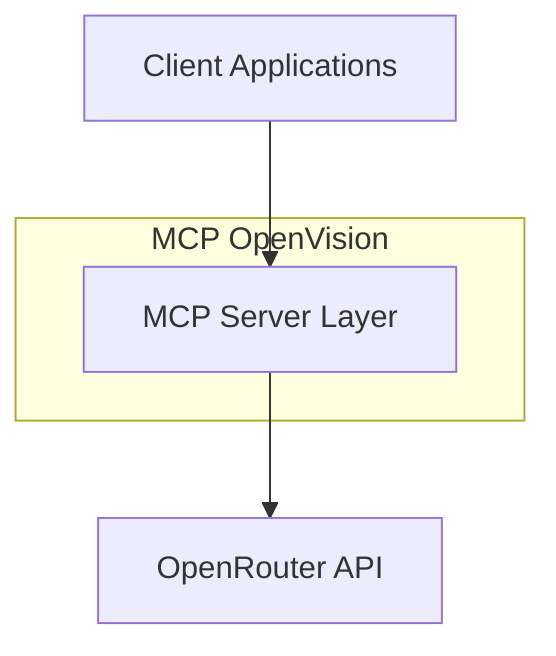
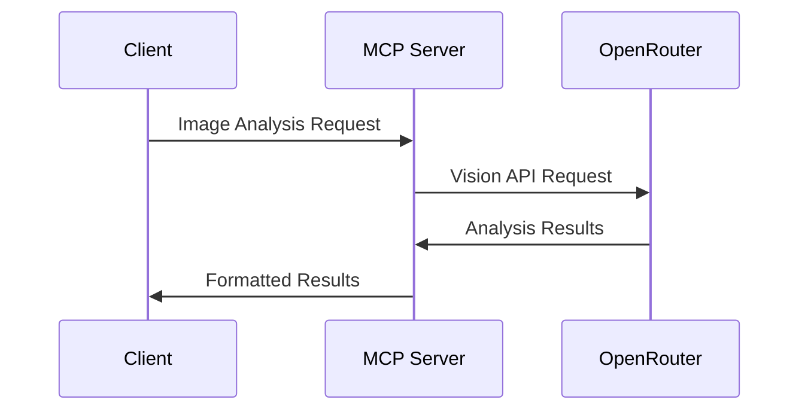
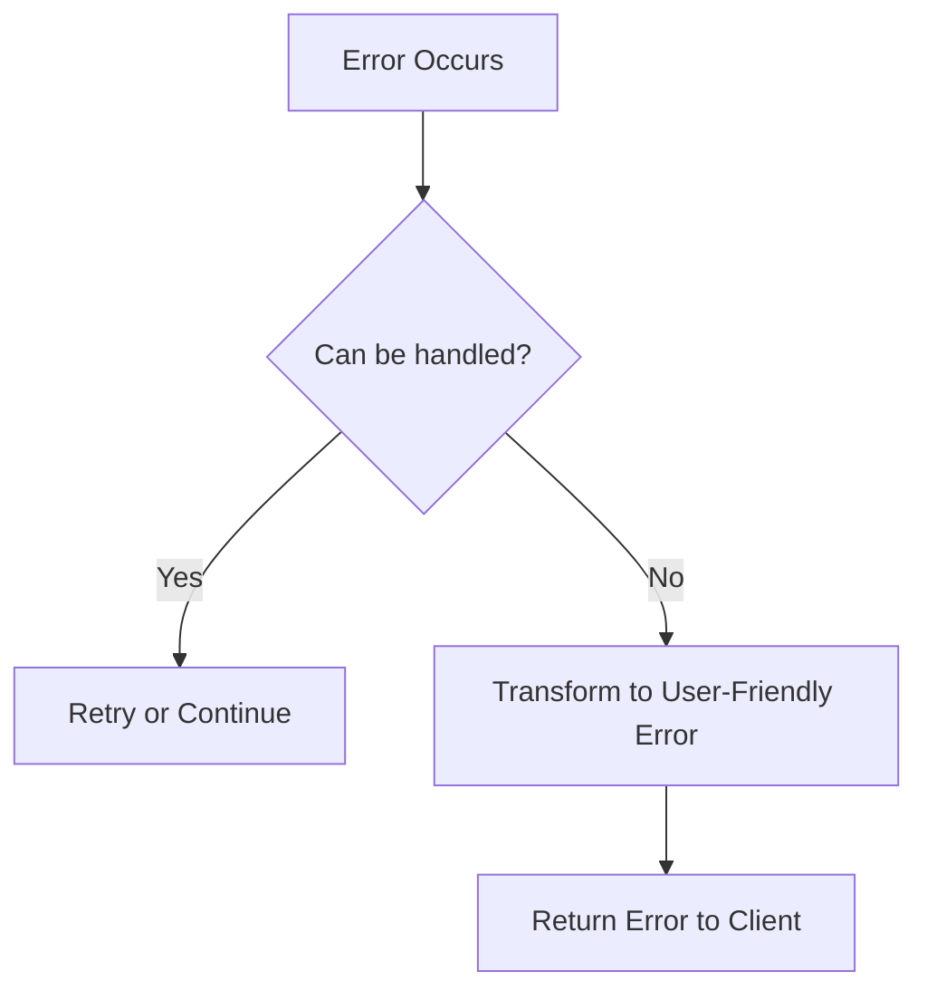
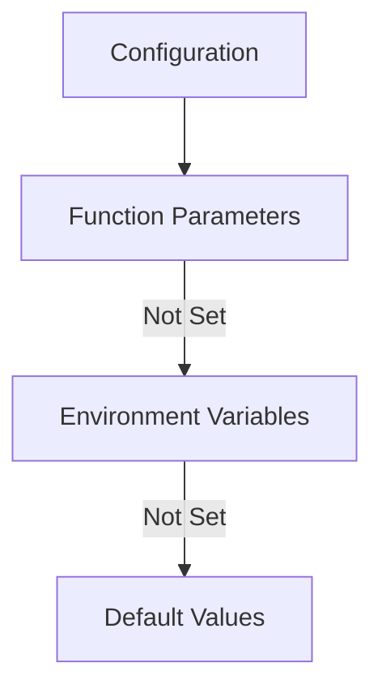
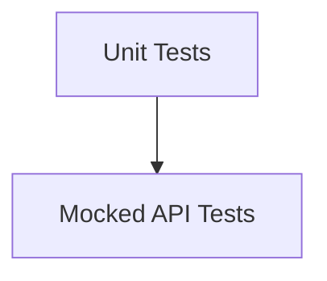

# System Patterns

## Simplified Architecture

MCP OpenVision follows a straightforward architecture:

## Core Components

### MCP Server Module

- **Purpose**: Provide MCP-compliant tools for image analysis
- **Pattern**: Follows standard MCP tool definitions
- **Key File**: `server.py`

### Essential Utilities

- **Error Handling**: Simple exception hierarchy
- **Configuration**: Basic environment variable support
- **Image Processing**: Minimal preprocessing helpers

## Data Flow

The system follows a simple request-response flow:

## Error Handling Approach

Basic error handling pattern:

## Configuration

Simple configuration from environment variables:

## Testing Strategy

Focus on core functionality testing:

## MCP Compliance

The project strictly adheres to MCP patterns:

1. **Tool Definitions**: Using `@mcp.tool()` decorators
2. **Type Annotations**: Following MCP type definitions
3. **Async Patterns**: Using proper async/await patterns
4. **Error Handling**: Returning informative errors
